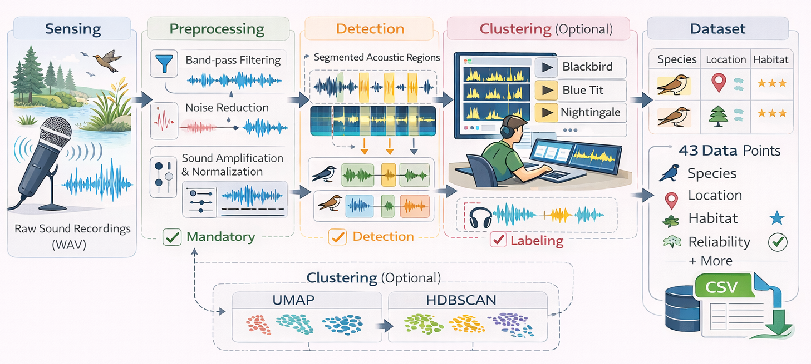
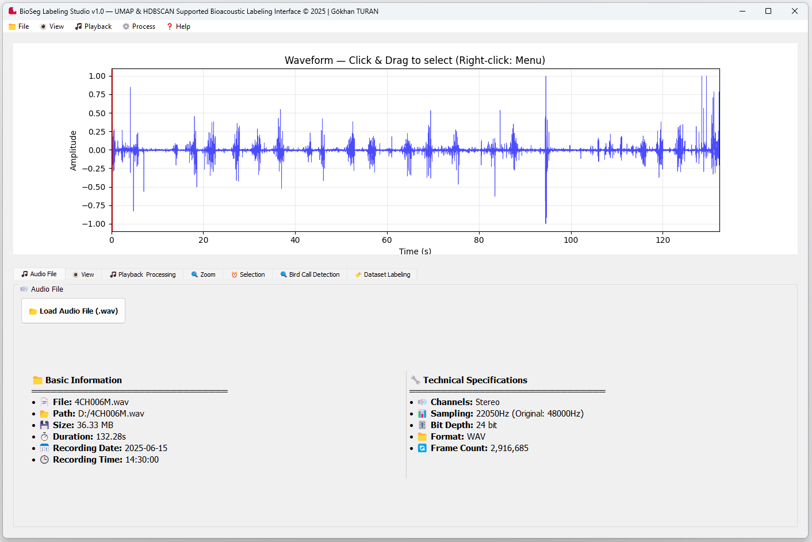
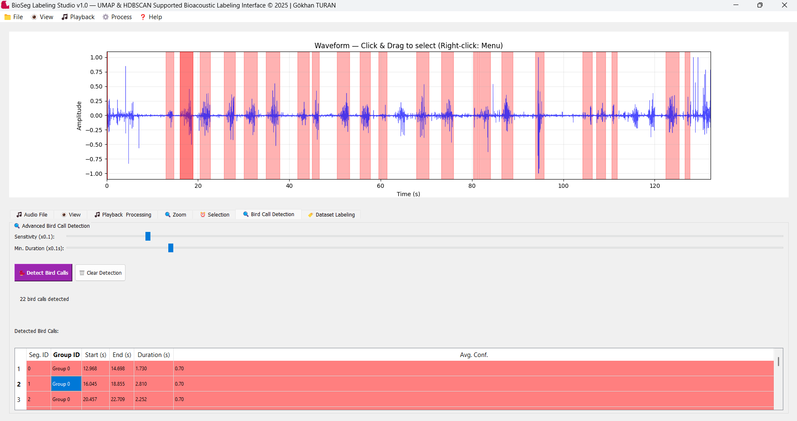
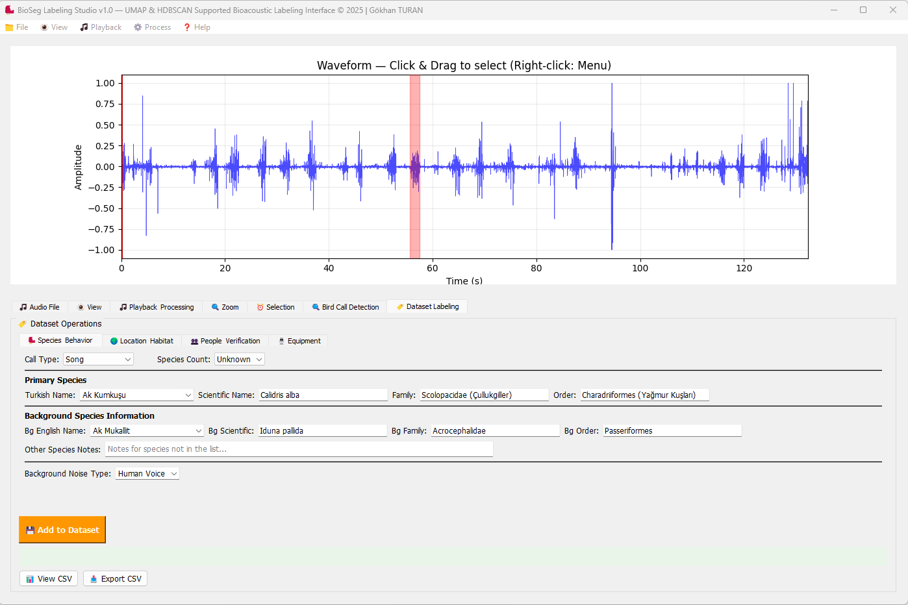

# 🐦 BioSeg Labeling Studio

[](https://www.gnu.org/licenses/gpl-3.0)
[](https://www.python.org/downloads/)

BioSeg is an open-source research software designed to facilitate segmentation, labeling, and structured dataset generation of bird vocalizations. It integrates waveform and spectrogram visualization, noise reduction, loudness normalization, and optional UMAP+HDBSCAN clustering to assist manual annotation workflows.

---

## ✨ Features

- **Audio Visualization**: Interactive waveform and spectrogram (linear/Mel) displays
- **Preprocessing**: Band-pass filtering (500–10000 Hz), noise reduction (spectral gating), LUFS normalization
- **Segmentation Support**: Energy-based detection with adjustable sensitivity and duration
- **Optional Clustering**: UMAP dimensionality reduction + HDBSCAN (or DBSCAN) for acoustic grouping
- **Rich Metadata**: 43 structured fields including taxonomy, habitat, equipment, verification status
- **Dataset Export**: Segments saved as WAV files + CSV with complete metadata
- **Playback Controls**: Full recording or selected region, adjustable speed, loop mode
- **Cross-Platform**: Runs on Windows, Linux, and macOS

---

## 🔧 Installation

### Install from source (recommended for developers)

1. Clone the repository:
   ```bash
   git clone https://github.com/gokhanturan/bioseg.git
   cd bioseg
2. Create a virtual environment (optional but recommended):
   ```bash
    python -m venv venv
    source venv/bin/activate  # On Windows: venv\Scripts\activate
3. Install dependencies:
    ```bash
   pip install -r requirements.txt
4. Run BioSeg:
    ```bash
    python src/main.py
  
## Troubleshooting
### Linux (Ubuntu/Debian)
If pip install -r requirements.txt fails with errors related to soundfile:
  ```bash 
  sudo apt-get install libsndfile1
  pip install --upgrade pip
  pip install -r requirements.txt
  ```
### Windows
If you encounter build errors, install Microsoft C++ Build Tools from:
https://visualstudio.microsoft.com/visual-cpp-build-tools/
Then retry:
  ```bash 
  pip install --upgrade pip
  pip install -r requirements.txt
  ```
### General
If pip is not recognized, use:
  ```bash 
  python -m pip install -r requirements.txt
  ```

## 🎯 Quick Start Guide

### 1. Load Audio
Click **"📂 Load Audio File"** and select a WAV file. The waveform and spectrogram will be displayed automatically. Recording metadata (duration, sample rate, channels) appears in the info panel.

### 2. Explore the Visualization
- **Zoom**: Scroll mouse wheel
- **Pan**: Right-click + drag
- **Select region**: Left-click + drag
- **Reset zoom**: Click "Reset Zoom" button or press `Ctrl+0`

### 3. Preprocess (Optional)
- Check **"🧹 Denoise"** to reduce background noise (spectral gating)
- Check **"🔊 LUFS Normalization"** to standardize volume levels
- Click **"▶ Run Actions"** to apply preprocessing to the selected region or full recording

### 4. Detect Bird Calls
Click **"🐦 Detect Bird Calls"** to automatically find acoustic segments.
- Adjust **Sensitivity** (higher = more detections)
- Adjust **Min. Duration** (exclude short noises)

Detected segments appear in the table with start/end times, duration, and confidence scores.

### 5. Cluster Similar Sounds (Optional)
Enable clustering before detection. BioSeg will:
- Extract MFCC and spectral contrast features from each segment
- Reduce dimensionality with UMAP
- Group similar segments with HDBSCAN

Segments from the same species share a color and group ID, allowing batch labeling.

### 6. Label the Segment
Fill in metadata in the right panel:
- **Species & Behavior**: Call type, species count, scientific name
- **Location & Habitat**: Site, habitat type, coordinates
- **People & Verification**: Recordist, ornithologist, confidence level
- **Equipment**: Microphone, recorder model

### 7. Save to Dataset
Click **"💾 Add to Dataset"**. The segment is saved as:
- A WAV file in the `segments/` folder
- One row in `bird_sound_dataset.csv` with 43 metadata fields

All annotations are saved in `bird_sound_dataset.csv` and WAV files in the `segments/` folder.

## 🖼️ Screenshots

### Workflow Overview
  
*Fig. 1. Overall workflow of the BioSeg software.*

### Main Interface
  
*Fig. 2. Main BioSeg interface showing waveform visualization, segment selection, and recording metadata.*

### Clustering Panel
  
*Fig. 3. Optional clustering interface showing grouped acoustic segments identified using UMAP and HDBSCAN.*

### Labeling and Export
  
*Fig. 4. Dataset labeling and metadata management interface with structured CSV export functionality. Species and location fields shown are for illustrative purposes only and do not necessarily reflect the taxonomic content of the example recording.*

## 📊 Output Format
Each annotated segment generates:
- One WAV file saved in the `segments/` folder  
  `{original_name}_Habitat{ID}_{Species}_{Date}.wav`
- One row in `bird_sound_dataset.csv` containing the following 43 metadata fields:


| #  | Category       | Field Name                  | Description                                      |
|----|----------------|-----------------------------|--------------------------------------------------|
| 1  | Recording      | Original_Recording_Name     | Original file identifier                         |
| 2  | Recording      | Original_File_Path          | Source file path                                 |
| 3  | Recording      | Original_Duration           | Total duration (s)                               |
| 4  | Recording      | Channels                    | Audio channels                                   |
| 5  | Recording      | File_Format                 | Audio format (e.g., WAV)                         |
| 6  | Recording      | Bit_Depth                   | Bit resolution                                   |
| 7  | Recording      | Recording_Date              | Recording date                                   |
| 8  | Recording      | Recording_Time              | Recording time                                   |
| 9  | Segment        | Filename                    | Segment filename                                 |
| 10 | Segment        | File_Path                   | Segment file path                                |
| 11 | Segment        | Start_Time                  | Segment start (s)                                |
| 12 | Segment        | End_Time                    | Segment end (s)                                  |
| 13 | Segment        | Duration                    | Segment duration (s)                             |
| 14 | Call Info      | Call_Type                   | Vocalization type                                |
| 15 | Call Info      | type_Count                  | Call occurrence count                            |
| 16 | Taxonomy       | Order                       | Taxonomic order                                  |
| 17 | Taxonomy       | Family                      | Taxonomic family                                 |
| 18 | Taxonomy       | Scientific_Name             | Species scientific name                          |
| 19 | Taxonomy       | Turkish_Name                | Species local name                               |
| 20 | Background     | Background_Order            | Background species order                         |
| 21 | Background     | Background_Family           | Background species family                        |
| 22 | Background     | Background_Scientific_Name  | Background species scientific name               |
| 23 | Background     | Background_Turkish_Name     | Background species local name                    |
| 24 | Background     | Background_Noise_Type       | Environmental noise type                         |
| 25 | Background     | Notes_For_Other_Species     | Additional species notes                         |
| 26 | Location       | Location                    | Site identifier                                  |
| 27 | People         | Recordist                   | Recorder identity                                |
| 28 | People         | Ornithologist               | Expert annotator                                 |
| 29 | Verification   | Verification_Status         | Validation state                                 |
| 30 | Verification   | Confidence_Level            | Annotation confidence                            |
| 31 | Equipment      | Microphone                  | Microphone model                                 |
| 32 | Equipment      | Recorder                    | Recording device                                 |
| 33 | Habitat        | Habitat_ID                  | Habitat identifier                               |
| 34 | Habitat        | Habitat_Type                | Habitat classification                           |
| 35 | Habitat        | Code                        | Habitat/site code                                |
| 36 | Location       | UTM_Zone                    | UTM zone                                         |
| 37 | Location       | UTM_Easting                 | UTM Easting                                      |
| 38 | Location       | UTM_Northing                | UTM Northing                                     |
| 39 | Location       | Lat                         | Latitude                                         |
| 40 | Location       | Lon                         | Longitude                                        |
| 41 | Location       | Google_Maps                 | Map reference link                               |
| 42 | Notes          | Notes                       | Free text notes                                  |
| 43 | Project        | Project                     | Project identifier                               |

## ⚖️ License

This project is licensed under the GNU General Public License v3.0. See the LICENSE file for details.

## 📝 Citation

If you use **BioSeg** in your research, please cite the following peer-reviewed SoftwareX article:

> G. Turan, E. U. Küçüksille, and H. Süel,
> “BioSeg: An open-source software for bioacoustic segmentation, cluster-assisted labeling, and dataset generation,”
> *SoftwareX*, vol. 35, art. no. 102902, 2026.
> https://doi.org/10.1016/j.softx.2026.102902

**Article page:**
https://www.sciencedirect.com/science/article/pii/S2352711026003936

### BibTeX

```bibtex
@article{Turan2026BioSeg,
  title   = {BioSeg: An open-source software for bioacoustic segmentation, cluster-assisted labeling, and dataset generation},
  author  = {Turan, G{\"o}khan and K{\"u}{\c{c}}{\"u}ksille, Ecir U{\u{g}}ur and S{\"u}el, Halil},
  journal = {SoftwareX},
  volume  = {35},
  pages   = {102902},
  year    = {2026},
  issn    = {2352-7110},
  doi     = {10.1016/j.softx.2026.102902},
  url     = {https://doi.org/10.1016/j.softx.2026.102902}
}
```


## 📬 Contact

- **Gökhan TURAN** - [gokhanturan@mehmetakif.edu.tr](mailto:gokhanturan@mehmetakif.edu.tr)
- **Project Repository**: [https://github.com/gokhanturan/bioseg](https://github.com/gokhanturan/bioseg)

## 🙏 Acknowledgements
This work was supported by the Scientific and Technological Research Council of Türkiye (TÜBİTAK) under the 1001 Scientific and Technological Research Projects Funding Program (Project No: 123O927), titled "Calculation, Modelling and Mapping of Functional Diversity of Bird Species".

## 📁 Project Structure

```text
bioseg/
├── src/
│   ├── audio/           # Audio loading, processing, and utilities
│   ├── detection/       # Bird call detection and feature extraction
│   ├── clustering/      # UMAP + HDBSCAN grouping
│   ├── visualization/   # Spectrogram computation
│   ├── data/            # Configuration and CSV handling
│   ├── ui/              # Main application window
│   └── main.py          # Application entry point
├── examples/            # Example audio recordings
├── screenshots/         # Interface screenshots
├── tests/               # Unit tests
├── requirements.txt     # Python dependencies
├── README.md            # Documentation
└── LICENSE              # GPL-3.0 license
```
